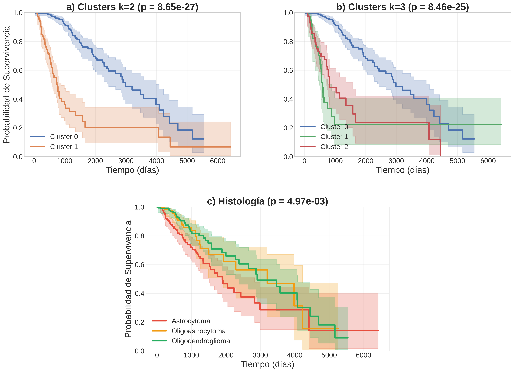
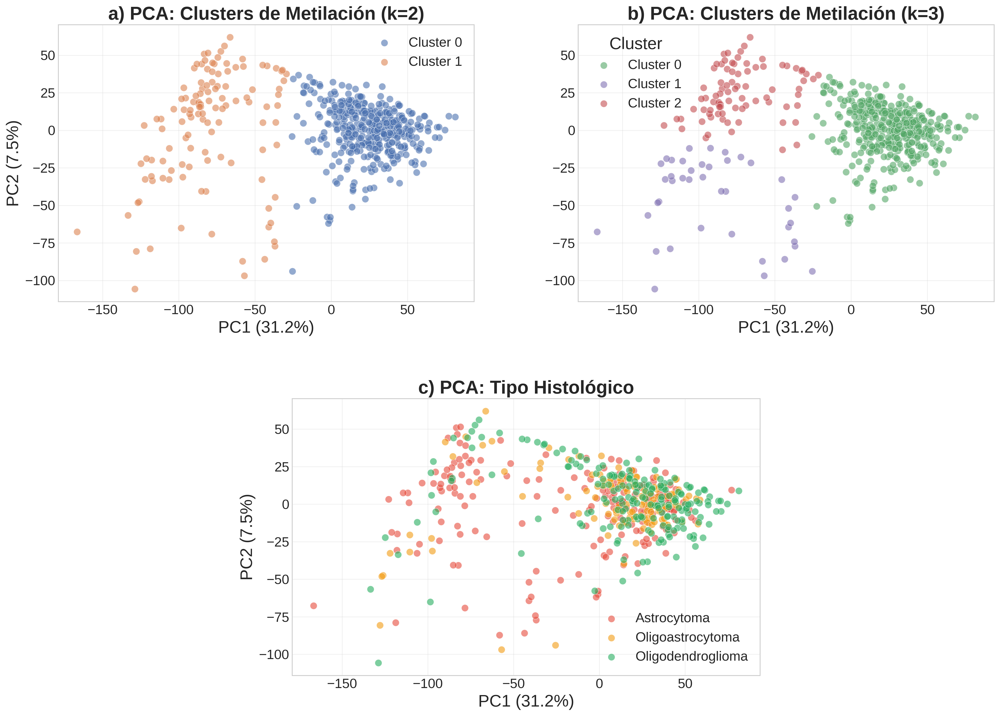

# Glioma Methylation Clustering

Unsupervised molecular classification of low-grade gliomas using DNA methylation profiles, and analysis of its impact on oncological coding systems (ICD-O).

## Overview

Traditional histological classification of brain gliomas suffers from significant interobserver variability — up to 42.8% diagnostic disagreement between pathologists. This project demonstrates that **DNA methylation-based clustering provides far superior prognostic stratification** compared to conventional histology.

Using data from 515 patients in the TCGA-LGG cohort, K-Means clustering on methylation profiles identifies two molecular subgroups with dramatically different survival outcomes (log-rank p = 8.65 x 10⁻²⁷), compared to the modest separation achieved by histological subtyping (p = 4.97 x 10⁻³).

The project also examines why current clinical coding systems (ICD-O-3) fail to capture these molecular distinctions, and reviews the implications for cancer registries, clinical documentation, and the transition to ICD-11.

## Key Results

### Survival Stratification



Molecular clustering (left) achieves significantly better prognostic separation than traditional histological classification (right).

### Cluster Visualization



Methylation-based clusters form well-separated groups in PCA space, while histological subtypes overlap considerably within the same molecular clusters.

## Methods

- **Dataset:** TCGA-LGG (515 patients, 20,115 genes) from [LinkedOmics](http://www.linkedomics.org/)
- **Preprocessing:** Median imputation, variance filtering (7,803 genes retained), StandardScaler
- **Dimensionality reduction:** PCA (370 components, 94.85% variance explained)
- **Clustering:** K-Means (k=2, silhouette = 0.314) and GMM
- **Validation:** Kaplan-Meier survival analysis, log-rank test
- **Visualization:** t-SNE, PCA scatter plots

## Project Structure

```
├── glioma_methylation_clustering.ipynb   # Full analysis notebook
├── docs/
│   └── clinical_coding_impact.pdf        # Extended report: molecular classification
│                                         # and its impact on ICD-O coding systems
├── slides/
│   └── presentation.pdf                  # Project presentation
├── figures/
│   ├── kaplan_meier_comparison.png       # Survival curves comparison
│   └── pca_clusters_vs_histology.png     # PCA cluster visualization
├── requirements.txt
└── LICENSE
```

## Data Source

**TCGA-LGG methylation dataset** obtained from the [LinkedOmics portal](http://www.linkedomics.org/).

> **Note:** This repository includes code and documentation only. Raw data are not redistributed and must be downloaded from the official source.

## Technologies

Python · scikit-learn · lifelines · PCA · K-Means · GMM · Kaplan-Meier · matplotlib · seaborn

## How to Reproduce

```bash
pip install -r requirements.txt
jupyter notebook glioma_methylation_clustering.ipynb
```

Download the TCGA-LGG methylation data from [LinkedOmics](http://www.linkedomics.org/) and place it in the working directory before running the notebook.

> **Note:** The analysis notebook is written in Spanish.

## License

[MIT](LICENSE)
